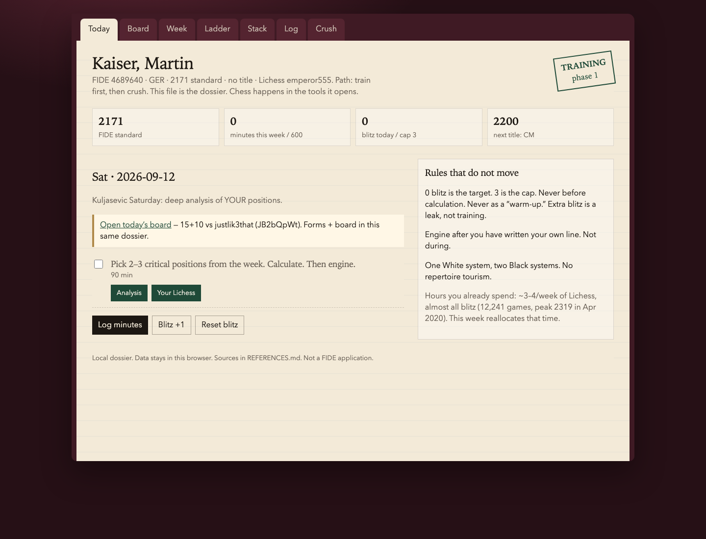
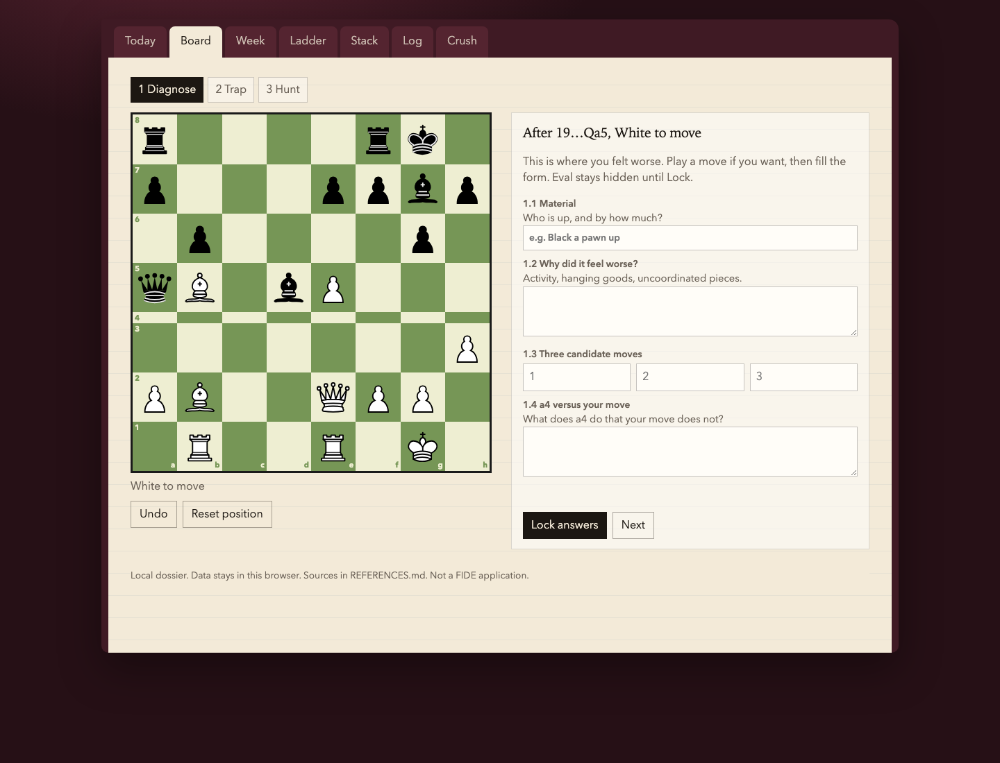
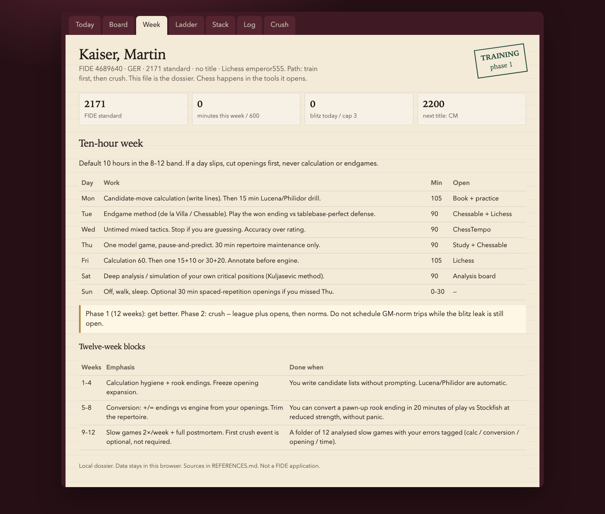

# Zwischenzug

The **in-between move** — see it before you recapture. This week that was `22.e6` after `…Bxg2`, not `Kxg2`. The same habit as stopping at `…a6`: the first reply is not the line.

A local training dossier for a **2171 FIDE** player who wants the GM title — without building another chess site.

A local training dossier for a **2171 FIDE** player who wants the GM title — without building another chess site.

It does three jobs in one file:

1. **Tell you what to train today** (and cap the blitz leak)
2. **Walk a real game** on a proper board, with forms you fill *before* the engine exists
3. **Keep the title ladder honest** — CM 2200, then FM 2300, then IM/GM norms

Open it:

```bash
open index.html
```

No server, no account, no cloud. Sessions live in this browser (`localStorage`). Export JSON from **Log** if you want a backup.

---

## Screenshots

**Today** — Saturday protocol, blitz cap, the week’s slow-work checklist.



**Board** — Lichess-green board, CBurnett Staunton pieces, last-move tint, legal-move dots. The game is [JB2bQpWt](https://lichess.org/JB2bQpWt) (15+10, you White). Eval stays hidden until you lock the form.



**Week** — ten-hour plan and the 12-week blocks.



---

## Why this exists

[Kaiser, Martin, Dr.](https://ratings.fide.com/profile/4689640) (GER, FIDE 4689640) is **2171 standard**, untitled. Lichess [`emperor555`](https://lichess.org/@/emperor555) has **12,241 blitz** games (peak 2319 in 2020, now ~2085) and **zero classical**.

GM is **2500 + three GM norms** ([FIDE Title Regulations B.01](https://handbook.fide.com/chapter/B012024)). That is +329 rating and a tournament life. This app does not grant that. It stops spending the week on 3-minute games and puts the hours on calculation, endgames, and slow play.

The next stamp is **CM 2200**, then **FM 2300**.

## Locked rules

| | |
|---|---|
| Hours | ~10 / week (8–12 band) |
| Blitz | 0 preferred, **cap 3**, never before calculation |
| Phase | Train first. Crush (opens, norms) later |
| Engine | After you have written your own line |

## What you actually train with

The dossier does **not** replace these. It opens them.

| Job | Tool |
|---|---|
| Calculation book | Aagaard, *Grandmaster Preparation: Calculation* |
| Rated tactics | [ChessTempo mixed, untimed](https://chesstempo.com/chess-tactics/) |
| Endgames | de la Villa *100 Endgames You Must Know* / Chessable + [Lichess practice](https://lichess.org/practice) |
| Slow games | Lichess **15+10 or 30+20** only |
| Analysis | [Lichess analysis](https://lichess.org/analysis) — notes first |
| Openings | Chessable, tiny repertoire, no tourism |

## Tabs

| Tab | What |
|---|---|
| **Today** | Weekday protocol + blitz counter |
| **Board** | Interactive post-mortem of the 15+10 (diagnose → trap → hunt) |
| **Week** | 10-hour split and 12-week blocks |
| **Ladder** | CM / FM / IM / GM from FIDE B.01 |
| **Stack** | The existing software, with how to use it here |
| **Log** | Sessions and slow games |
| **Crush** | Tournament volume — parked until the leak is closed |

## Board session (this week’s game)

You were worse after **19…Qa5**. You played **20.Red1**. He took on **a2** and the queen died to **Ra1–Ra3**.

The session forces the honest order:

1. **Diagnose** the worse position (candidates, a4 vs Red1)
2. **Trap** — play `…Qxa2` then `Ra1` on the board
3. **Hunt** — `Ra3`, then tag **calculation**, not “clean”

Pieces are [CBurnett](https://github.com/lichess-org/lila/tree/master/public/piece/cburnett) (public domain), the same Staunton set Lichess uses. Board colours are Lichess green (`#eeeed2` / `#769656`) with a last-move wash. Move generation is [chess.js 0.10.3](https://github.com/jhlywa/chess.js) (MIT).

## Next work

Read [`HANDOFF.md`](HANDOFF.md) before adding features. The gap is calculation depth (he stopped at `…a6`), not more UI.

## Files

```
index.html              one app
sessions/JB2bQpWt.json  this week’s game (source of truth)
sessions/bundle.js      packed for file:// — run scripts/bundle_sessions.py
session-board.js        generic board (loads PATH_SESSIONS)
scripts/author_session.py   Stockfish offline → SAN tree / stub JSON
scripts/bundle_sessions.py  json → bundle.js
chess.min.js            legal moves
pieces.js               CBurnett SVGs
```

Add a new slow game: write `sessions/<lichessId>.json`, then `python3 scripts/bundle_sessions.py`. Open `index.html?session=<id>#session`. No edit to `session-board.js`.

## Attribution

Title thresholds: FIDE Handbook B.01 (2024). Player card: ratings.fide.com/4689640. Lichess stats: emperor555, retrieved 2026-09-12. Methods: Aagaard *Calculation*, de la Villa *100 Endgames*, Kuljasevic workbook vol. 3. Details in [`REFERENCES.md`](REFERENCES.md).

This is not a FIDE application.
